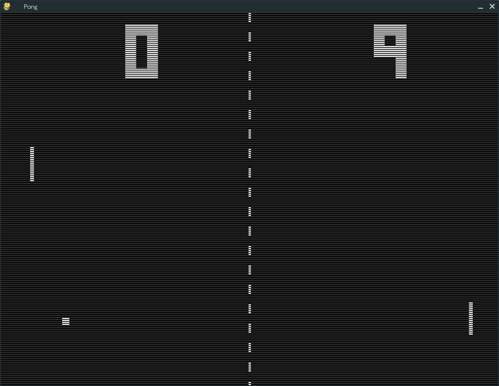

# Pong-Classic
The classic pong with pygame in python.

Notes that direction of the ball is affected by the speed of the paddle, just like the original game.
(The original pong gameplay on youtube: <https://www.youtube.com/watch?v=it0sf4CMDeM>)

## Play
`python pong.py`  
or  
`python3 pong.py`

## Control
The game can be controlled by:
  - arrow-key (up and down)
  - mouse wheel
  - `F` toggle full screen
  - `ESC` exit the game

## Credit
- Based on the original work of Samuel Suen
- Modified by Francisco Sanchez Arroyo
- Sounds captured from the original ROM
- Bit 5x3 Font by Matt Lagrandeur <http://www.mattlag.com/bitfonts/>
